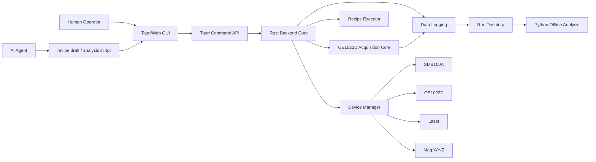
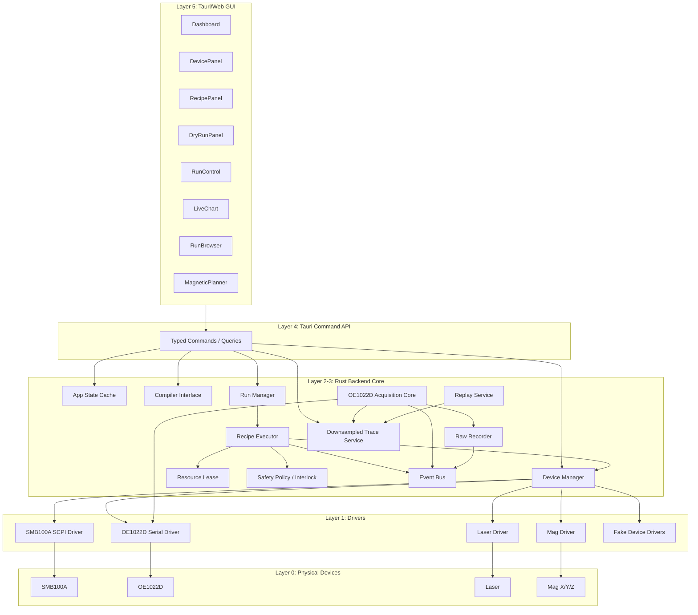
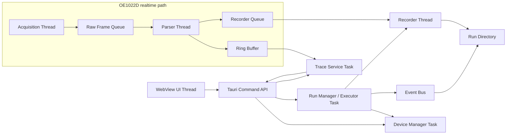
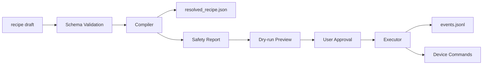
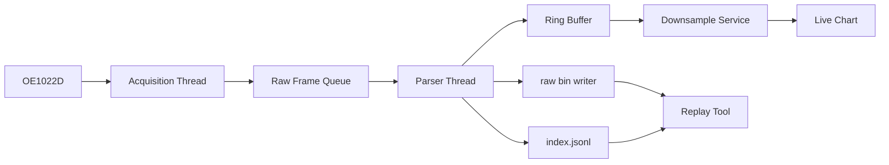

# Sub-PRD 01: Architecture PRD v0.2

> 文件定位：系统架构 Sub-PRD  
> 所属项目：odor-ctl-web / ODMR Automation  
> 上级文档：00_main_prd.md v0.2  
> 当前阶段：架构冻结前的 v0.2 草案  
> 目标读者：系统设计者、Rust 后端开发者、Tauri/Web 前端开发者、AI/coding agent、实验执行模块开发者  

---

## 0. 文档目的

本文件负责把主 PRD 中的总原则落到系统架构层面，重点冻结：

```text
1. Rust / Python / Tauri / AI agent 的职责边界
2. 前端、后端、设备、采集、执行器、数据落盘之间的依赖方向
3. 进程模型、线程模型、任务模型
4. 实时采集链路与非实时链路的隔离方式
5. GUI、AI、Python 分析代码禁止触碰的硬件边界
6. 安全、日志、数据追溯在架构中的位置
7. 面向多 agent 开发时的模块边界和禁止循环依赖规则
```

本文件不是具体设备协议说明。SMB100A、OE1022D、磁场、GUI、数据格式、recipe schema、safety interlock 的细节分别下沉到对应 Sub-PRD。

---

## 1. Purpose

本模块解决的问题是：**防止新系统再次退化成 GUI、设备控制、采集、绘图、AI、数据分析混在一起的单体程序。**

旧系统的主要风险不是单纯“Python 慢”，而是：

```text
GUI 线程
设备命令
状态轮询
高频采集
图表刷新
文件写入
AI 调用
数据分析
```

容易共享同一批对象、线程、串口、VISA session 或事件循环，导致：

```text
1. 高频采集被 GUI 或状态查询打断
2. 设备命令来源不唯一
3. AI agent 可以绕过人类审查
4. 数据点无法追溯到 recipe step
5. CSV / 图表 / 分析逻辑进入实时链路
6. 多 agent 开发时模块互相改动，形成循环依赖
```

本 Architecture PRD 的目标是建立清晰的系统边界：

```text
GUI 只交互
Rust core 只执行和采集
Python 只生成 recipe 与离线分析
AI agent 只生成文本 / JSON 草案
设备只能由受控 executor / device manager 访问
实时数据先 raw-first 落盘，再离线转 parquet / csv
```

---

## 2. Scope

本 PRD 负责定义：

```text
1. 总体架构分层
2. 进程模型
3. Rust 内部任务 / 线程模型
4. 模块依赖方向
5. 硬件访问边界
6. 实时采集链路
7. recipe 执行链路
8. 数据流和事件流
9. GUI 与后端 API 边界
10. Python / AI 参与边界
11. 安全 interlock 在系统中的调用位置
12. mock / replay / harness 在架构中的位置
13. 架构级验收标准
```

本 PRD 不负责定义：

```text
1. 具体 JSON schema 字段全集
2. OE1022D RALL? frame 二进制格式
3. SMB100A 全部 SCPI 指令表
4. Tauri 具体页面布局
5. 磁场 coil matrix 的数学细节
6. laser / mag 设备的完整驱动协议
7. ML 模型训练流程
8. 论文数据集的完整统计指标
```

这些内容由对应 Sub-PRD 承担。

---

## 3. Non-goals

第一阶段 Architecture 明确不做：

```text
微服务化
分布式实验室平台
多用户权限系统
复杂插件系统
Go 服务层
AI 在线闭环控制硬件
Python 常驻硬件控制服务
Web 前端解析 raw binary
GUI 直接调用串口 / TCP socket / VISA
实时 CSV 作为主数据格式
采集线程做谱线拟合或机器学习
```

架构设计必须服务于第一阶段的目标：**本地桌面应用 + Rust 高性能核心 + 可追溯实验运行 + mock-first 开发。**

---

## 4. Architecture Principles

### 4.1 单一硬件访问入口

所有真实硬件访问必须经过：

```text
Device Manager
→ Resource Lease
→ Executor / Acquisition Core
→ Device Driver
```

禁止：

```text
GUI 直接访问硬件
AI 直接访问硬件
Python notebook 直接访问运行中的硬件
多个模块同时持有同一设备连接
状态查询直接打断高频采集
```

---

### 4.2 实时链路和非实时链路隔离

实时链路只做必要动作：

```text
read
timestamp
parse
buffer
raw write
minimal event
```

非实时链路包括：

```text
GUI 展示
CSV 导出
Parquet 转换
谱线拟合
ML 分析
报告生成
AI 解释
```

非实时链路不得阻塞实时采集链路。

---

### 4.3 依赖方向固定

模块依赖只能朝一个方向流动：

```text
Frontend
  ↓
Tauri Command API
  ↓
Application Services
  ↓
Domain Core
  ↓
Device Drivers / Storage / Harness
```

禁止反向依赖：

```text
Device Driver 不能依赖 GUI
Storage 不能依赖 GUI
OE1022D acquisition core 不能依赖 recipe editor
SMB100A driver 不能依赖 AI agent
Safety policy 不能依赖 frontend state
```

---

### 4.4 Recipe 是实验逻辑来源

实验运行必须来自：

```text
recipe.json
→ compiler
→ resolved_recipe.json
→ safety_report.json
→ dry-run
→ user approval
→ executor
```

executor 不接受：

```text
未展开 recipe
未通过 schema 的 recipe
未通过 safety 的 recipe
未 dry-run 的 recipe
AI 直接发来的动作
GUI 临时拼出的危险命令
```

---

### 4.5 Raw-first 数据原则

实时阶段只允许写：

```text
raw bin
index.jsonl
events.jsonl
warnings.jsonl
errors.jsonl
```

实验后再生成：

```text
parsed.parquet
sweep_points.parquet
export.csv
summary.json
figures
```

CSV 永远不是实时主数据格式。

---

## 5. System Context

### 5.1 外部参与者

```text
Human Operator
  通过 GUI 选择 recipe、查看 dry-run、批准运行、停止实验、查看实时曲线。

AI Agent
  生成 recipe 草案、解释参数、生成分析脚本、总结结果。
  不直接访问硬件。

Python Analysis
  读取 parsed parquet / raw replay 结果，做拟合、统计、ML、notebook 分析。
  不参与实时采集。

Physical Devices
  SMB100A、OE1022D、Laser、Mag X/Y/Z、APD 信号链。
```

---

### 5.2 系统上下文图



---

## 6. High-level Architecture

### 6.1 分层结构

```text
Layer 0: Physical Devices
  SMB100A
  OE1022D
  Laser
  Mag X/Y/Z
  APD signal path

Layer 1: Device Drivers
  smb100a-driver
  oe1022d-driver / oe1022d-core
  laser-driver
  mag-driver
  fake-device drivers

Layer 2: Domain Core
  device registry
  resource lease
  safety policy
  recipe compiler interface
  recipe executor
  timing / averaging
  event model

Layer 3: Runtime Services
  acquisition service
  recorder service
  trace service
  run manager
  replay service
  harness service

Layer 4: Application API
  Tauri commands
  local IPC boundary
  file import / export commands

Layer 5: GUI
  dashboard
  device panel
  recipe panel
  dry-run panel
  run control
  live chart
  run browser
  magnetic planner

Layer 6: AI / Python Offline
  recipe generation
  lint / explain
  offline analysis
  ML training
  report scripts
```

---

### 6.2 架构总图



---

## 7. Process Model

### 7.1 第一阶段推荐模型

第一阶段采用 **单桌面应用进程 + Rust 内部多任务 + Python 离线进程**。

```text
Tauri Desktop Process
  ├─ WebView frontend
  ├─ Rust Tauri command API
  ├─ Rust backend runtime
  ├─ device manager
  ├─ executor
  ├─ OE1022D acquisition thread
  ├─ recorder thread
  ├─ trace service
  └─ replay / harness service

Python Process / Script
  ├─ AI recipe generation
  ├─ recipe lint / explanation
  ├─ offline data analysis
  ├─ fitting / ML / notebook
  └─ export / report utilities
```

Python 不作为硬件控制常驻服务。

---

### 7.2 未来可扩展模型

第二或第三阶段可以引入：

```text
local analysis worker
remote run scheduler
database ingestion service
dataset server
```

但必须保持：

```text
实时采集核心仍在 Rust
设备硬件访问仍由 Device Manager / Executor 控制
AI 仍不能直接访问硬件
```

---

## 8. Runtime Task / Thread Model

### 8.1 Rust 后端任务划分

```text
main runtime task
  初始化 app state、配置目录、日志、Tauri command handlers。

device manager task
  负责 connect / disconnect / idn / status cache / capability cache。

executor task
  持有 run lifecycle，按 resolved_recipe 执行步骤。

oe acquisition thread
  高频读取 OE1022D raw frame 或 RALL? 响应。
  只做读取和基础 timestamp，不做复杂解析和绘图。

oe parser thread
  解析 raw frame，生成 sample record，写 ring buffer 和 recorder queue。

recorder thread
  写 raw bin、index.jsonl、events.jsonl。

trace service task
  从 ring buffer 读取最近窗口，做降采样，服务 GUI 查询。

event bus task
  汇总 run events、device events、warning、error。

replay task
  从 raw bin / index 重放数据，用于测试和离线检查。
```

---

### 8.2 线程模型图



---

### 8.3 线程边界硬规则

```text
1. GUI 线程不得读取设备。
2. GUI 线程不得解析 RALL? binary frame。
3. acquisition thread 不得访问 GUI state。
4. acquisition thread 不得写 CSV。
5. acquisition thread 不得做谱线拟合、平均、ML。
6. parser thread 不得发设备命令。
7. recorder thread 不得调用 GUI。
8. executor task 不得直接读取 raw ring buffer。
9. trace service 只读 ring buffer，不持有设备 lease。
10. status query 不得打断 acquisition thread 的高频读取。
```

---

## 9. Module Dependency Rules

### 9.1 推荐 Rust workspace 结构

```text
crates/
  odmr-types/
    通用数据结构、ID、timestamp、units、errors。

  odmr-config/
    station config、profile loading、path config。

  odmr-safety/
    safety policy、limit check、safety report。

  odmr-recipe/
    recipe structs、resolved_recipe structs、schema binding。

  odmr-compiler/
    profile/block resolve、sweep expansion、duration estimate。

  odmr-executor/
    run lifecycle、step execution、resource lease integration。

  odmr-device/
    device registry、transport abstraction、device state cache。

  odmr-smb100a/
    SMB100A SCPI commands、socket transport、fake scpi client tests。

  odmr-oe1022d/
    OE1022D serial commands、RALL? acquisition、parser、ring buffer。

  odmr-laser/
    laser driver abstraction。

  odmr-mag/
    mag axis driver、coil current preview、ramp plan interface。

  odmr-logging/
    run directory、raw bin writer、index/events writer。

  odmr-replay/
    raw replay、parser replay、trace replay。

  odmr-harness/
    fake devices、mock run、integration tests。

  odmr-tauri/
    Tauri command handlers、frontend API boundary。
```

---

### 9.2 依赖方向

```text
odmr-types
  ↑ 被所有模块依赖，但不依赖任何业务模块。

odmr-config
  → odmr-types

odmr-safety
  → odmr-types
  → odmr-config

odmr-recipe
  → odmr-types

odmr-compiler
  → odmr-types
  → odmr-recipe
  → odmr-safety

odmr-device
  → odmr-types
  → odmr-config

device-specific crates
  → odmr-types
  → odmr-device

odmr-logging
  → odmr-types
  → odmr-recipe

odmr-executor
  → odmr-types
  → odmr-recipe
  → odmr-device
  → odmr-safety
  → odmr-logging

odmr-tauri
  → application service crates
  但其他核心 crate 不依赖 odmr-tauri
```

---

### 9.3 禁止依赖

```text
odmr-types 禁止依赖任何业务 crate
odmr-oe1022d 禁止依赖 odmr-tauri
odmr-smb100a 禁止依赖 odmr-tauri
odmr-logging 禁止依赖 GUI
odmr-safety 禁止依赖 GUI
odmr-device 禁止依赖 AI / Python
odmr-executor 禁止依赖 frontend 组件
odmr-compiler 禁止访问真实硬件
odmr-tauri 禁止直接访问 serial / socket / VISA
Python 禁止作为 Rust core 的强依赖
```

---

### 9.4 循环依赖禁止规则

任何 PR 或 agent output 如果引入以下结构，必须拒绝：

```text
GUI ↔ device driver
executor ↔ frontend
safety ↔ GUI state
compiler ↔ hardware driver
logging ↔ chart rendering
acquisition ↔ recipe editor
AI ↔ live hardware
```

---

## 10. Data Flow Architecture

### 10.1 Recipe flow



---

### 10.2 Acquisition flow



---

### 10.3 Event flow

所有关键动作都必须转为事件：

```text
device_connected
device_disconnected
idn_checked
recipe_loaded
schema_passed
schema_failed
compile_started
compile_finished
safety_passed
safety_failed
dry_run_generated
user_approved
run_started
step_started
command_sent
command_returned
settle_started
settle_finished
sample_window_started
sample_window_finished
step_finished
warning_raised
error_raised
stop_requested
emergency_stop
safe_shutdown_started
safe_shutdown_finished
run_finished
run_failed
```

事件必须写入：

```text
events.jsonl
warnings.jsonl
errors.jsonl
```

必要事件同时进入 GUI 状态缓存。

---

## 11. Device Access Architecture

### 11.1 Device Manager 职责

Device Manager 负责：

```text
1. 根据 station config 注册设备
2. 建立 transport
3. 执行 connect / disconnect
4. 读取 IDN
5. 缓存 connection status
6. 暴露 capabilities
7. 管理 safe disconnect
8. 提供设备句柄给 resource lease / executor
9. 对 fake device 和 real device 使用同一接口
```

Device Manager 不负责：

```text
实验流程
recipe 展开
实时采集解析
GUI 绘图
AI 生成
数据分析
```

---

### 11.2 Resource Lease

所有会改变真实设备状态的操作必须通过 resource lease。

```text
lease fields:
  lease_id
  run_id
  owner
  device_ids
  created_at
  expires_at / heartbeat
  priority
  can_be_interrupted_by_emergency_stop
```

规则：

```text
1. 同一设备同一时刻只能被一个 active lease 持有。
2. emergency stop 可以中断所有 lease。
3. GUI 普通状态查询只能读缓存，不获得写 lease。
4. manual override 必须产生 event。
5. lease 丢失时 executor 必须停止并进入 safe shutdown。
```

---

### 11.3 Device Driver 接口

所有设备驱动至少实现：

```text
connect()
disconnect()
idn()
status()
capabilities()
safe_shutdown()
```

会输出能量、磁场、电流或激光的设备还必须实现：

```text
apply_safe_preset()
validate_command_against_capability()
```

---

## 12. GUI Boundary

### 12.1 GUI 可以做

```text
显示设备状态缓存
请求连接 / 断开设备
加载 recipe 文件
显示 schema / compile / safety 结果
显示 dry-run
请求用户批准运行
start / stop / emergency stop
显示实时降采样曲线
显示 run directory
调用 magnetic planner 生成 block JSON
```

---

### 12.2 GUI 不可以做

```text
直接访问串口
直接访问 TCP socket
直接访问 VISA
直接发送 SCPI
直接发送 OE1022D command
直接解析 RALL? binary
直接写 raw bin
实时写 CSV
维护实验 step 状态机
绕过 executor 运行硬件
绕过 safety limit
```

---

### 12.3 GUI 与 Rust API 边界

GUI 只调用 typed commands，例如：

```text
list_devices()
connect_device(device_id)
disconnect_device(device_id)
get_device_status_snapshot()
load_recipe(path)
validate_recipe(recipe_id)
compile_recipe(recipe_id)
get_dry_run(resolved_recipe_id)
approve_run(resolved_recipe_id)
start_run(resolved_recipe_id)
request_stop(run_id)
request_emergency_stop()
get_live_trace(channel, window, max_points)
open_run_directory(run_id)
export_run(run_id, format)
```

这些 API 只暴露业务动作，不暴露底层 serial / socket handle。

---

## 13. AI / Python Boundary

### 13.1 AI agent 可以做

```text
生成 recipe 草案
生成 block 草案
解释 recipe
检查明显参数风险
生成 notebook 分析脚本
总结 run metadata
生成 PRD / schema / test 草案
```

---

### 13.2 AI agent 不可以做

```text
直接访问硬件
直接发送 SCPI / serial 命令
直接启动 run
修改 station safety limit
覆盖 human approval
绕过 schema validation
绕过 safety check
绕过 dry-run
在运行中直接插入动作
```

---

### 13.3 Python 可以做

```text
AI recipe generation
recipe lint / explain
offline fitting
ML training
dataset manifest generation
parquet / csv post-process
notebook visualization
```

Python 不做：

```text
OE1022D 高频采集
实时 executor
安全 interlock 执行
硬件常驻控制
GUI 主线程绘图
```

---

## 14. Safety Architecture

### 14.1 Safety 调用位置

Safety 必须至少出现在三个位置：

```text
1. compile 阶段：
   检查 recipe 展开后的每个 step 是否超限。

2. dry-run 阶段：
   将危险动作、人类需要确认的动作、预计最大值展示出来。

3. executor 阶段：
   执行前再次检查实际 device profile、station limit、lease 状态。
```

---

### 14.2 Safety 不依赖 GUI

Safety policy 必须来自：

```text
station_snapshot.json
device_profile
hard-coded conservative defaults
```

不得来自：

```text
frontend form transient state
AI agent message
未保存的临时 GUI 字段
```

---

### 14.3 Emergency stop

Emergency stop 触发后：

```text
1. 立即广播 emergency_stop event。
2. 中断 executor。
3. 中断所有 active lease。
4. 发送各设备 safe_shutdown。
5. 停止新增采样窗口。
6. 保留 raw recorder 完成 flush。
7. 写入 run_failed 或 run_aborted 状态。
8. GUI 显示不可继续运行，除非重新 reset。
```

---

## 15. Data Logging Architecture

### 15.1 Run Directory

每个 run 必须对应唯一目录：

```text
runs/
  <date>_<run_id>/
    raw/
    metadata/
    events/
    parsed/
    exports/
```

---

### 15.2 写入责任

```text
recorder thread:
  raw/oe1022d.rawbin
  raw/index.jsonl

event bus / executor:
  events/events.jsonl
  events/warnings.jsonl
  events/errors.jsonl

run manager:
  metadata/station_snapshot.json
  metadata/resolved_recipe.json
  metadata/safety_report.json
  metadata/device_idn.json

offline converter:
  parsed/*.parquet
  exports/*.csv
```

---

### 15.3 不可变原则

以下文件一旦 run started，不能被覆盖修改，只能追加或生成新版本：

```text
station_snapshot.json
resolved_recipe.json
safety_report.json
raw bin
index.jsonl
events.jsonl
```

如需修改，必须创建新的 run。

---

## 16. Error Handling Architecture

### 16.1 错误分级

```text
Info
  不影响运行，只记录。

Warning
  当前 step 可继续，但需要记录质量 flag。

Recoverable Error
  可以重试或跳过 step，但必须由 policy 决定。

Fatal Error
  run 失败，进入 safe shutdown。

Emergency
  立即停止全部设备输出，释放 lease，写入 emergency event。
```

---

### 16.2 常见错误处理

```text
device disconnected
  停止相关 run，触发 safe shutdown，写 error。

serial timeout
  按配置重试；超过阈值 fatal。

SMB command error
  查询 error queue；无法清除则 fatal。

OE parser error
  标记 frame bad；连续错误超过阈值 fatal。

recorder write error
  fatal；不能继续无记录实验。

safety violation during run
  emergency or fatal，取决于 violation 类型。

GUI disconnected / frozen
  采集继续，executor 不依赖 GUI heartbeat。
```

---

## 17. Test Harness Architecture

### 17.1 Harness 是一等模块

Harness 不是后期补丁。第一阶段必须同步建设：

```text
fake OE1022D
fake RALL frame generator
fake SMB100A SCPI server
fake laser serial
fake mag axis
mock run
dry-run tests
raw replay
timestamp alignment tests
safety rejection tests
```

---

### 17.2 Harness 接入位置

fake device 必须实现真实 device driver 的同一接口：

```text
DeviceDriver trait
  ├─ Real SMB100A socket driver
  ├─ Fake SMB100A SCPI server client
  ├─ Real OE1022D serial driver
  ├─ Fake OE1022D frame source
  ├─ Real laser driver
  ├─ Fake laser driver
  ├─ Real mag driver
  └─ Fake mag driver
```

executor 和 GUI 不应知道当前是 fake 还是真设备，只能从 station config / runtime badge 看到模式。

---

### 17.3 无设备可运行

以下命令必须在无真实设备时可运行：

```text
cargo test
recipe validation tests
compiler tests
safety rejection tests
mock run
fake scpi integration test
raw replay test
trace downsample test
```

---

## 18. API / Interface

### 18.1 内部 trait 示例

```rust
trait DeviceDriver {
    fn connect(&mut self) -> Result<DeviceId, DeviceError>;
    fn disconnect(&mut self) -> Result<(), DeviceError>;
    fn idn(&mut self) -> Result<String, DeviceError>;
    fn status(&mut self) -> Result<DeviceStatus, DeviceError>;
    fn capabilities(&self) -> DeviceCapabilities;
    fn safe_shutdown(&mut self) -> Result<(), DeviceError>;
}
```

```rust
trait ScpiDevice {
    fn write(&mut self, command: &str) -> Result<(), DeviceError>;
    fn query(&mut self, command: &str) -> Result<String, DeviceError>;
}
```

```rust
trait FrameSource {
    fn read_frame(&mut self) -> Result<RawFrame, AcquisitionError>;
}
```

以上只是架构约束，最终接口以实现阶段为准。

---

### 18.2 Tauri command API 原则

```text
1. API 必须是业务语义，不暴露硬件 handle。
2. API 必须可序列化。
3. API 返回值必须适合 GUI 展示。
4. API 不得让 frontend 构造危险底层命令。
5. API 必须能在 fake mode 下运行。
```

---

## 19. Deliverables

本 Architecture PRD 对应交付物：

```text
docs/prd/01_architecture_prd.md

docs/architecture/ARCHITECTURE.md
docs/architecture/module_dependency_diagram.md
docs/architecture/process_model_diagram.md
docs/architecture/thread_model_diagram.md

crates workspace 初始结构
核心 trait 草案
fake device 接口草案
Tauri command API 草案
ADR 初稿：
  ADR-001-tauri-ui.md
  ADR-002-rust-oe1022d-core.md
  ADR-003-smb100a-scpi-socket-first.md
  ADR-004-json-recipe-driven.md
  ADR-005-no-ai-live-hardware.md
  ADR-006-raw-bin-before-csv.md
```

---

## 20. Acceptance Criteria

### 20.1 架构文档验收

```text
1. 新开发者只读 00_main_prd 和 01_architecture_prd，可以理解系统分层。
2. 能明确回答 Rust、Python、Tauri、AI agent 各自负责什么。
3. 能明确回答哪些模块可以访问硬件。
4. 能明确回答 GUI 为什么不能直接访问硬件。
5. 能明确回答 OE1022D 实时采集链路如何避开 GUI 卡顿。
6. 能明确回答 CSV 为什么不能作为实时主数据格式。
7. 能明确回答 fake device 如何接入真实运行路径。
8. 能明确回答 emergency stop 在架构中的传播路径。
```

---

### 20.2 代码结构验收

```text
1. Rust workspace 初始 crate 结构与依赖方向一致。
2. 核心类型在 odmr-types，不依赖业务模块。
3. device-specific crate 不依赖 GUI。
4. safety crate 不依赖 GUI。
5. compiler crate 不访问硬件。
6. executor 不接受未 resolved recipe。
7. Tauri command 不暴露 serial / socket handle。
8. fake device 和 real device 使用同一接口。
9. cargo test 可在无设备环境运行。
10. 没有循环依赖。
```

---

### 20.3 运行时验收

```text
1. GUI 卡顿不影响 OE1022D acquisition thread。
2. Live chart 只读取降采样 trace。
3. recorder write error 会导致 run fatal，不会继续无记录运行。
4. emergency stop 能打断 executor 和 active lease。
5. mock run 可以完整生成 run directory。
6. raw replay 可以重建 trace。
7. 所有危险设备命令在 events.jsonl 可追溯。
```

---

## 21. Agent Constraints

### 21.1 所有 coding agent 的通用规则

每个 agent 任务必须声明：

```text
scope
inputs
outputs
allowed files
forbidden files
test requirements
review checklist
```

---

### 21.2 Architecture Agent

允许修改：

```text
docs/prd/01_architecture_prd.md
docs/architecture/*
docs/adr/*
```

禁止修改：

```text
真实设备驱动实现
OE1022D parser 实现
SMB100A SCPI 指令实现
GUI 具体页面实现
safety limit 数值
```

---

### 21.3 Device Agent

允许修改对应 device crate。

禁止：

```text
修改 GUI
修改 recipe schema
修改 safety policy
修改其他设备 driver
绕过 DeviceManager / ResourceLease
```

---

### 21.4 GUI Agent

允许修改：

```text
frontend components
Tauri command type binding
UI state display
chart rendering
```

禁止：

```text
直接访问硬件
解析 raw binary
新增底层 SCPI command input
绕过 dry-run approval
改动 executor 状态机
```

---

### 21.5 AI Recipe Agent

允许：

```text
生成 recipe draft
生成 block draft
解释参数
建议扫描范围
生成分析脚本
```

禁止：

```text
启动 run
发送硬件命令
修改 station safety policy
把危险命令藏在自由文本里
要求 executor 接受未校验 JSON
```

---

## 22. Open Questions

以下问题留到后续 PRD 或 ADR 决定：

```text
1. Rust async runtime 使用 tokio 还是标准线程为主？
2. OE1022D RALL? 采集是否需要独占串口，还是允许低频状态 query 复用？
3. SMB100A 第一版是否只支持 LAN socket，是否需要 USB/GPIB fallback？
4. Python recipe generation 与 Tauri GUI 的交互方式：文件导入，还是 local command？
5. Run directory 是否需要 SQLite manifest，还是先保持纯文件结构？
6. downsample 算法第一版使用 min/max envelope、LTTB，还是二者都支持？
7. magnetic planner 是否在第一版进入主 GUI，还是先作为独立页面/工具？
```

---

## 23. Revision Plan

```text
v0.2:
  冻结职责边界、依赖方向、线程模型、进程模型。

v0.3:
  补充 Rust workspace 真实 crate 名称、核心 trait、Tauri command 初稿。

v0.4:
  与 02–12 Sub-PRD 对齐，删除重复内容，保留架构边界。

v1.0:
  在 M1 mock-first 系统跑通后冻结。
```
