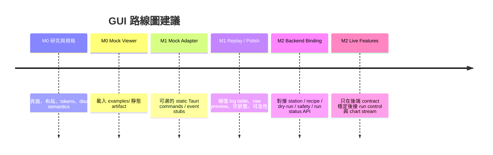

# odmrctl-web 的 GUI-M0 Mock-only Tauri+React 規格研究報告

## 執行摘要

這個倉庫目前已經把 GUI 的**架構邊界**定得很清楚，但還沒有把 GUI-M0 落到「可直接交付前端實作」的線框與元件等級。`README.md`、`AGENTS.md`、`docs/architecture/ARCHITECTURE.md`、`docs/adr/ADR-001-tauri-ui.md`、`docs/adr/ADR-004-no-ai-live-hardware.md` 與 `docs/prd/08_gui_tauri_chart_prd_v0.2.md` 一致強調：GUI 只負責展示、操作意圖與狀態監控；硬體存取、run authority、safety 決策、raw data 寫入與 recipe/executor 邏輯，必須留在 Rust 後端，不可由 GUI 或 AI 直接碰觸。這與你要的 GUI-M0「只能做 skeleton / mock viewer」是完全一致的。citeturn6view0turn37view0turn9view0turn13view1turn15view0

就 repo 現況而言，`apps/desktop/` 目前只有 `.gitkeep`，代表前端工程幾乎尚未開始；但 `examples/` 已經提供了做 GUI-M0 所需的核心靜態 artifact：`examples/recipes/basic_odmr_mock.recipe.json`、`examples/resolved/basic_odmr_mock.dry_run_plan.json`、`examples/safety/basic_odmr_mock.safety_report.json`，以及 `examples/runs/basic_odmr_mock_executor_run/` 下的 `manifest.json`、`events.jsonl`、`index.jsonl`、`raw/oe1022d.rawbin` 與 `metadata/`。因此最合理的 M0 不是去「假裝控制實驗」，而是把這些 artifact 做成一個**明確標示 mock-only 邊界**的工業風 viewer。citeturn8view0turn16view0turn17view0turn29view0turn30view0

我建議把 GUI-M0 定義成八個頁面：`Dashboard`、`Devices`、`Recipe`、`Dry Run`、`Safety`、`Events`、`Raw Data Preview`、`About / Boundaries`。這不是憑空重寫需求，而是把 `Sub-PRD 08` 的正式 GUI page model 做一次 M0 化裁切：保留 Dashboard、Devices、Recipes、Dry Run、Run Logs / Data Runs 的資訊性部分；把 Run Control、Live Charts、Settings、Magnetic Planner 延到後續；同時補上一個 About / Boundaries 頁，把「不能碰硬體」與「M2 才能 bring-up」公開寫進界面。citeturn14view0turn15view0

在視覺與人機工效上，這份規格建議採用**偏工業控制台**的藍白灰、高資訊密度、左側導覽、頂部 persistent 狀態列，以及非常清楚的 disabled / stale / safety 狀態。這樣的方向與 Siemens Industrial Experience 所推崇的 industrial-context design、efficient、modular、inclusive 原則相容，但不需要照搬 Siemens 品牌資產；同時所有顏色、焦點樣式、狀態訊息與標籤，都應符合 WCAG 2.2 對「不可只用顏色傳意」、「文字對比至少 4.5:1」、「可見 keyboard focus」、「輸入需有 labels / instructions」、「互動元件需有可程式判定 name/role/value」的要求。citeturn43view0turn40view3turn45view0turn45view1turn45view2turn45view3turn45view4

## 倉庫現況與設計邊界

`odmrctl-web` 的分層現在已經很明確：Layer 5 是 `apps/desktop/` 的 Tauri/Web GUI，Layer 4 是 Tauri commands，Layer 3 才是 executor / logging / replay / harness，Drivers 與 safety 都再往下；`GUI/Python 禁止直接訪問硬體` 也被寫進了架構入口文件。這表示 GUI-M0 的根本任務不是提前做 M2 的 control panel，而是先把**界面契約、資料映射與 UX 邊界**定穩。citeturn37view0turn6view0

`ADR-001` 把 Tauri + Web frontend + React + TypeScript + Rust command/event boundary 定為桌面 GUI 方案，並明文禁止前端直接做 serial / USB / VISA / socket 存取、SCPI 直發、OE1022D raw frame parsing、safety 決策與 raw data 寫入。`ADR-004` 又再把 AI / agent 的權限切得更窄：AI 只能產生候選物，不能成為 live executor、driver、resource lease holder、safety bypass 或 emergency-stop authority。這兩份 ADR 的合併效果，就是 GUI-M0 必須是**proposal-neutral、execution-neutral、hardware-neutral** 的 viewer。citeturn9view0turn13view1

`Sub-PRD 08` 其實已經給了正式 GUI 的 page model、command naming、event model、safety-visible principle 與 acceptance criteria；只是它仍偏向完整 GUI，而不是你現在要的 mock-only 版本。另一方面，repo 目前的 `apps/desktop/` 只有 `.gitkeep`，根目錄列表也看不到既有的 `package.json`。因此，最適合的做法不是「直接開始做真後端綁定」，而是先在 `apps/desktop/` 內局部引入一個獨立的 Tauri + React + Vite 結構，再以 `examples/` 做 bundled mock data。citeturn15view0turn8view0turn35view0

 repo 已經具備足夠好的 M0 資料基底。`basic_odmr_mock.recipe.json` 提供 recipe metadata：名稱為 *Basic ODMR Frequency Sweep (Mock)*，intent 是 `cw_odmr`，掃描軸是 `smb100a.rf.frequency_hz`，範圍 2.82–2.92 GHz、步距 500 kHz， acquisition 以 `oe1022d_01` 為 Ch-B，readout 含 `x/y/r/theta/freq/noise`，且預丟棄 300 ms、取樣窗 500 ms。對應的 dry-run summary 明確給出 step count = 201、estimated duration = 201.0 s、required device = `smb100a_01`。safety report 為 `decision: allow`、`checked_steps: 201`、`error_count: 0`、`findings: []`。run artifact 也完整：`manifest.json` 指向 `events.jsonl`、`index.jsonl`、`raw/oe1022d.rawbin` 與四個 lock files；`events.jsonl` 有 407 行，從 `run_created` 到 `run_completed`；`index.jsonl` 有 201 行，第一筆 offset 0 / length 16 / `step_000001`，最後一筆 offset 3200 / length 16 / `step_000201`；`oe1022d.rawbin` 檔案大小為 3.14 KB。這些已足夠支撐完整的 mock viewer。citeturn33view0turn20view2turn21view0turn29view0turn24view0turn24view2turn31view0turn31view2turn31view3turn30view0

下表是**repo 正式 GUI page model** 與**本次 GUI-M0 建議頁面**的對位結果。正式版 page model 來自 `docs/prd/08_gui_tauri_chart_prd_v0.2.md`；GUI-M0 則是依 repo 現況與 mock-only 邊界做的最小切片。citeturn14view0turn15view0

| 正式 GUI page model | GUI-M0 建議頁面 | M0 處理方式 |
|---|---|---|
| Dashboard | Dashboard | 保留；只顯示 mock run summary 與 phase |
| Devices | Devices | 保留；全部 connect / control disabled |
| Recipes | Recipe | 保留；顯示 metadata、sweep、acquisition |
| Dry Run | Dry Run | 保留；顯示 201 steps，採分頁 |
| Run Control | Dashboard + disabled 控件 | 不獨立成頁，先做 visual affordance |
| Live Charts | 不做 live chart page | 延後到 M1/M2；M0 不做假 streaming |
| Run Logs | Events | 保留，但讀 `events.jsonl` 靜態檔 |
| Data Runs | Raw Data Preview | 只做 rawbin / index metadata preview |
| Magnetic Planner | 不做 | 明確列為 deferred |
| Settings | About / Boundaries | 改成邊界揭露頁，避免早做危險設定 |

## 可交付的 GUI-M0 規格文件

以下內容可直接整理成 `docs/gui/GUI-M0-spec.md`。這份規格刻意把「頁面、布局、元件、disabled 文案、錯誤狀態、可及性」寫到工程 handoff 可用的程度，同時維持 mock-only 邊界。規格的骨架來自 repo 現有的 PRD / ADR；具體文案與 wireframe 則是為 GUI-M0 補足的實作層定義。citeturn14view0turn15view0turn9view0turn13view1

### Scope

GUI-M0 的定位是：**mock-only Tauri desktop shell + React viewer**。它可以載入 repo 既有 example artifact，做展示、互動、分頁、篩選、JSON 預覽、run 狀態摘要與假設備狀態頁；它**不能**連接真實設備、不能呼叫 executor、不能寫檔、不能發出任何硬體命令、不能把前端變成 canonical experiment state owner。這份界線完全符合 `AGENTS.md`、`ARCHITECTURE.md`、`ADR-001` 與 `ADR-004`。citeturn6view0turn37view0turn9view0turn13view1

**M0 納入範圍**

- Dashboard
- Devices
- Recipe
- Dry Run
- Safety
- Events
- Raw Data Preview
- About / Boundaries

**M0 排除範圍**

- 真實 Device Registry / connect / disconnect
- 真實 recipe validate / compile / approve / start_run
- Live Charts streaming
- Settings 中任何 safety / power / limits 編輯
- Magnetic Planner
- CSV / parquet 匯出
- 任何 hardware authority

### Global Layout

建議採工業控制面板式應用殼層：

```text
┌──────────────────────────────────────────────────────────────────────┐
│ Top Bar: App title | System phase | Safety badge | Mock-only badge  │
├───────────────┬──────────────────────────────────────────────────────┤
│ Left Nav      │ Persistent Banner                                   │
│ Dashboard     ├──────────────────────────────────────────────────────┤
│ Devices       │ Page Header + Actions                               │
│ Recipe        ├──────────────────────────────────────────────────────┤
│ Dry Run       │ Content area: cards / tables / JSON preview         │
│ Safety        │                                                      │
│ Events        │                                                      │
│ Raw Data      │                                                      │
│ About         │                                                      │
└───────────────┴──────────────────────────────────────────────────────┘
```

這種 layout 一方面符合 `PRD 08` 對 persistent safety status / emergency stop visibility 的要求，另一方面也符合 Siemens iX 在 industrial context 中強調的 efficient、modular and flexible、inclusive 設計方向。M0 雖然不會真的啟動 e-stop，但仍應保留其持續可見的位置，作為 later-stage UI contract 的一部分。citeturn14view0turn15view0turn43view0turn40view3

**布局尺寸建議**

| 區塊 | 建議值 |
|---|---|
| Top bar 高度 | 56 px |
| Left nav 寬度 | 232 px |
| Left nav 收合寬度 | 72 px |
| 內容區 padding | 24 px |
| Card 間距 | 16 px |
| 表格列高 | 36 px |
| 內容最大寬度 | fluid，建議 1440–1680 px |

### Design Tokens

正式 repo 沒有既有 GUI token，因此 M0 應先建立一套**中性、可延展、符合工業 UI 的 token**。風格上可參考 Siemens iX 對 industrial UI / data analytics 的做法，但不要複製 Siemens 品牌識別；技術上則應以 WCAG 2.2 的對比與焦點可見性為底線。citeturn43view0turn40view3turn45view1turn45view2

| Token | 建議值 | 用途 |
|---|---|---|
| `color.bg.app` | `#F4F7FA` | 整體背景 |
| `color.bg.panel` | `#FFFFFF` | 卡片 / 表格 |
| `color.border.subtle` | `#D8E0EA` | 邊框 |
| `color.text.primary` | `#1F2937` | 主要文字 |
| `color.text.secondary` | `#5B6675` | 次要文字 |
| `color.accent.blue` | `#0B6FB8` | 主要互動色 |
| `color.success` | `#1F7A4C` | Allow / Healthy |
| `color.warning` | `#A36A00` | Warning / Mock |
| `color.danger` | `#B42318` | Fail / E-stop visual |
| `radius.card` | `8px` | 卡片圓角 |
| `shadow.card` | `0 1px 2px rgba(16,24,40,0.06)` | 卡片陰影 |
| `font.body` | `Inter, "Noto Sans TC", system-ui, sans-serif` | 內文 |
| `font.mono` | `ui-monospace, SFMono-Regular, Consolas, monospace` | path / hash / step_id |

### Navigation

左側導覽建議固定八項：

| Key | Label | 類型 |
|---|---|---|
| `dashboard` | Dashboard | primary |
| `devices` | Devices | primary |
| `recipe` | Recipe | primary |
| `dry-run` | Dry Run | primary |
| `safety` | Safety | primary |
| `events` | Events | primary |
| `raw-data` | Raw Data Preview | primary |
| `about` | About / Boundaries | primary |

Top bar 建議固定顯示四個狀態：

| 欄位 | 範例值 |
|---|---|
| App 標題 | `odmrctl-web GUI-M0` |
| System phase | `M1 mock complete / M2 hardware bring-up pending` |
| Safety badge | `Allow` |
| Mock badge | `Mock Viewer Only` |

### 頁面摘要表

下表是頁面層級的最小元素清單；逐頁 wireframe 與欄位定義見下一節。這裡特別把 repo artifact 來源標出來，方便實作時直接對應 `apps/desktop/src/mock-data/`。對 Dashboard / Dry Run / Safety / Events / Raw Data Preview 的主要資料，皆可直接由 example artifact 萃取。citeturn33view0turn20view2turn21view0turn29view0turn24view0turn31view0

| 頁面 | 主要元素 | 主要資料來源 | 主要互動 |
|---|---|---|---|
| Dashboard | Phase、summary cards、recent artifacts、disabled controls | `manifest.json`、`dry_run_plan`、`safety_report`、`events.jsonl` | 開頁、複製 run_id、導頁 |
| Devices | fake device cards、transport、required、disabled connect/control | `station.mock.json` + static UI status | 只讀、disabled tooltip |
| Recipe | metadata、intent、profiles、blocks、sweep、acquisition | `basic_odmr_mock.recipe.json` | 複製 path、展開 JSON |
| Dry Run | summary、required devices、201-step table | `basic_odmr_mock.dry_run_plan.json` | 分頁、搜尋 step_id |
| Safety | decision、summary、findings table | `basic_odmr_mock.safety_report.json` | 展開 raw JSON |
| Events | tail table、filters、counts | `events.jsonl` | filter / sort / copy row |
| Raw Data Preview | rawbin metadata、index preview、artifact browser | `manifest.json`、`index.jsonl`、raw file metadata | 分頁、copy path |
| About / Boundaries | allowed / forbidden、source docs、future integration notes | ADR / PRD / AGENTS | 連結外部 docs |

### Component Specs

建議最小元件集如下：

| 元件 | 規格 |
|---|---|
| `AppShell` | left nav + top bar + banner + content slot |
| `TopStatusBar` | phase / safety / mock badge / emergency-stop visual slot |
| `MockOnlyBanner` | persistent info banner；全頁共用 |
| `MetricCard` | title / value / subtext / source |
| `StatusBadge` | `allow` / `warning` / `danger` / `muted` 變體；同時有文字與 icon |
| `DeviceCard` | device_id / type / transport / required / status / controls |
| `DataTable` | sortable columns、sticky header、empty/loading/stale state |
| `JsonPreview` | collapsed tree + copy 按鈕 + monospace |
| `ActionBar` | page-level 按鈕列，所有 disabled 控件統一樣式 |
| `EmptyStatePanel` | icon / title / body / optional action |
| `TooltipReason` | 針對 disabled 控件說明不可用原因 |
| `MonospaceField` | 顯示 hash、step_id、path、device_id |

### Disabled Controls 與精確文案

M0 的重點不是把按鈕畫出來，而是把**不可用原因講清楚**。這一點與 `PRD 08` 的 safety-visible principle 完全一致：危險或未準備好的動作，不該只是灰掉，而要能說明為何灰掉。citeturn14view0turn15view0

| 控件 | 顯示文字 | 狀態 | Tooltip / helper text |
|---|---|---|---|
| Start Run | `Start Run` | disabled | `GUI-M0 不呼叫 executor；M2 backend integration 後才可啟用。` |
| Pause Run | `Pause Run` | disabled | `目前沒有 active run；此控件僅示意 run-control 位置。` |
| Stop Run | `Stop Run` | disabled | `GUI-M0 不持有 run authority；graceful stop 需後端實作。` |
| Emergency Stop | `Emergency Stop` | disabled but always visible | `依安全規格需持續可見；M0 僅做 visual-only，不觸發 safety path。` |
| Connect SMB100A | `Connect SMB100A` | disabled | `M2 bring-up only — GUI-M0 不存取 TCP / VISA / SCPI。` |
| Connect OE1022D | `Connect OE1022D` | disabled | `M2 bring-up only — GUI-M0 不存取 serial / USB。` |
| Query IDN | `Query IDN` | disabled | `Mock viewer only — 不做真實 probe。` |
| RF Output ON | `RF Output ON` | disabled | `Forbidden in GUI-M0 — 任何 RF 命令都不可由前端直接觸發。` |
| MOD ON | `MOD ON` | disabled | `Forbidden in GUI-M0 — modulation control 屬 live hardware authority。` |
| Approve Run | `Approve Run` | disabled | `Dry-run 在 M0 僅供閱讀；approval workflow 延後到 M2。` |
| Start Acquisition | `Start Acquisition` | disabled | `Mock viewer only — acquisition core 不在此階段接入。` |

**Banner 文案建議**

> `Mock Viewer Only — 本版只讀取 examples/ 中的靜態 artifact。它不連接 serial / USB / VISA / socket，不探測設備，不呼叫 executor，不發送 SCPI，也不寫入任何 run 檔案。`

### Empty / Error / Loading States

`PRD 08` 已定義 backend unavailable、device disconnect、chart backpressure、frontend reload、log too large 等錯誤模型；GUI-M0 雖不碰真後端，但仍應先把通用狀態樣板做出來，避免之後 M2 再補破口。citeturn15view0

| 狀態 | 顯示規格 |
|---|---|
| Loading | skeleton cards / table rows；頂部不閃爍；`aria-busy=true` |
| Empty | 置中 empty panel，顯示「找不到 mock artifact」與 source path |
| Error | inline error callout；可顯示檔名與欄位名；不出現 stack trace |
| Stale | 黃色 badge `stale mock data`；顯示最後載入時間 |
| Disabled due to M0 boundary | 不算 error；使用 muted style + tooltip reason |
| No findings | Safety 頁顯示 `No findings in this mock report.` |
| No filters match | Events / Dry Run 顯示 `No rows match current filters.` |

### Accessibility Notes

M0 雖然是內部桌面 GUI，也應按 WCAG 2.2 基線處理。這不是形式主義，而是因為工業界面往往同時依賴顏色、密集表格與鍵盤操作，若一開始不把可及性做進 design system，後面幾乎一定會欠債。WCAG 2.2 明確要求：顏色不能是唯一訊息載體、文字對比至少 4.5:1、keyboard focus 必須可見、需要輸入的地方要有 labels / instructions、互動元件需有可程式判定的 name / role / value。citeturn45view0turn45view1turn45view2turn45view3turn45view4

**最低要求**

- 所有 badge 除顏色外，還要有文字，如 `Allow`、`Warning`、`Disabled`。
- 所有 disabled 按鈕都保留 tooltip reason，並在 DOM 中保有 accessible name。
- Left nav 與 table toolbar 皆可完整 keyboard 操作。
- 焦點 ring 不可被移除；建議 2px 雙色 focus ring。
- 表格要使用原生 table 或具 ARIA role 的 data grid。
- 如果用 icon-only button，必加 `aria-label`。
- Loading / error / stale 訊息以 `aria-live="polite"` 公告。

### Acceptance Checklist

GUI-M0 驗收以**mock workflow 可展示、邊界不越界、disabled 原因清楚**為核心。這份 checklist 是從 `PRD 08` acceptance criteria 向下裁切而來，保留 repo 真正需要的界面契約，但移除 live control 要求。citeturn15view0

- [ ] `apps/desktop/` 能本機啟動 Tauri + React GUI。
- [ ] 頂部 persistent banner 明確標示 mock-only 邊界。
- [ ] Dashboard 能顯示 mock run summary、phase 與 safety badge。
- [ ] Recipe 頁能顯示 `basic_odmr_mock` metadata。
- [ ] Dry Run 頁能顯示 201 steps，且有分頁或可擴充 virtualization 策略。
- [ ] Safety 頁能顯示 `decision: allow` 與空 findings state。
- [ ] Events 頁能載入 `events.jsonl` 並顯示 `event_type / step_id / message`。
- [ ] Raw Data Preview 頁只顯示 rawbin size 與 index entries，不解析 binary payload。
- [ ] 所有 real-control 按鈕皆 disabled，且 tooltip 原因正確。
- [ ] 前端沒有 serial / USB / VISA / socket / SCPI / executor 直接呼叫。
- [ ] 若存在 Tauri commands，也只返回靜態 mock JSON。
- [ ] 不引入任何硬體 crate 到前端責任範圍。

### Completion Report Template

```md
## GUI-M0 Completion Report

### Files changed
- ...

### Pages created
- Dashboard
- Devices
- Recipe
- Dry Run
- Safety
- Events
- Raw Data Preview
- About / Boundaries

### Mock data source
- examples/recipes/basic_odmr_mock.recipe.json
- examples/resolved/basic_odmr_mock.dry_run_plan.json
- examples/safety/basic_odmr_mock.safety_report.json
- examples/runs/basic_odmr_mock_executor_run/...

### Disabled controls
- Start Run
- Pause Run
- Stop Run
- Emergency Stop
- Connect SMB100A
- Connect OE1022D
- Query IDN
- RF Output ON
- MOD ON

### How to run locally
```bash
cd apps/desktop
pnpm install
pnpm tauri dev
```

### What remains for real backend integration
- Replace bundled mock data with backend command/event adapters
- Bind Device Registry snapshot
- Bind recipe validation / compile / safety reports
- Bind executor run status
- Bind chart stream
- Keep GUI hardware-blind
```

## 各頁面 Wireframe 與資料映射

以下逐頁定義，直接面向實作。每頁都包含簡單 wireframe、元素清單、表格欄位、按鈕狀態、mock 資料映射與文案建議。頁面設計以 `PRD 08` 的 page responsibilities 為基礎，但只保留 GUI-M0 需要的一層。citeturn14view0turn15view0

### Dashboard

```text
┌ Page Header: Dashboard ──────────────────────────────────────────────┐
│ [Mock Viewer Only] [Allow] [M1 mock complete / M2 pending]          │
├──────────────────────────────────────────────────────────────────────┤
│ Card: Run ID    Card: Steps    Card: Duration    Card: Events        │
│ basic_odmr...   201            201.0 s           407                 │
├──────────────────────────────────────────────────────────────────────┤
│ Card: Recipe            Card: Safety             Card: Raw Preview   │
│ Basic ODMR ...          Allow / 0 findings       3.14 KB / 201 idx   │
├──────────────────────────────────────────────────────────────────────┤
│ Actions: [Start Run] [Pause Run] [Stop Run] [Emergency Stop]        │
│ all disabled with reasons                                            │
└──────────────────────────────────────────────────────────────────────┘
```

Dashboard 來源應整合 `manifest.json` 的 `run_id / resolved_recipe_id / safety_report_id`、dry-run 的 `step_count / estimated_duration_s`、safety report 的 `decision / findings`、events 的行數與最後事件、rawbin 的大小與 index 行數。這些都來自現成 example artifact，不需任何 live backend。citeturn29view0turn20view2turn21view0turn22view0turn31view0turn30view0

**主要元素**

| 區塊 | 元素 |
|---|---|
| Header | title、phase badge、mock badge、safety badge |
| Summary cards | run_id、recipe name、step_count、estimated_duration、event_count、rawbin size |
| Recent events | 最後 5 筆事件簡表 |
| Controls | Start/Pause/Stop/Emergency Stop，皆 disabled |
| Quick links | Open Recipe / Dry Run / Safety / Events / Raw Data |

**Dashboard 表格欄位**

若放「Recent events」小表格，欄位固定為：

| Table | Columns |
|---|---|
| Recent events | `timestamp_unix_ms`, `event_type`, `step_id`, `message` |

**按鈕清單**

| 按鈕 | 狀態 |
|---|---|
| Open Recipe | enabled |
| Open Dry Run | enabled |
| Open Safety | enabled |
| Open Events | enabled |
| Start Run | disabled |
| Pause Run | disabled |
| Stop Run | disabled |
| Emergency Stop | disabled but visible |

**Mock JSON mapping 範例**

```json
{
  "phase": "M1 mock complete / M2 hardware bring-up pending",
  "runSummary": {
    "runId": "basic_odmr_mock_executor_run",
    "stepCount": 201,
    "estimatedDurationS": 201.0,
    "safetyDecision": "allow",
    "eventCount": 407,
    "rawIndexCount": 201,
    "rawbinSizeLabel": "3.14 KB"
  }
}
```

這個 mapping 可由 `examples/runs/basic_odmr_mock_executor_run/manifest.json`、`examples/resolved/basic_odmr_mock.dry_run_plan.json`、`examples/safety/basic_odmr_mock.safety_report.json`、`events.jsonl`、`index.jsonl` 與 `raw/oe1022d.rawbin` 推導。citeturn29view0turn20view2turn21view0turn22view0turn31view0turn30view0

**Banner / tooltip 文案**

- Banner：`This dashboard reflects static mock artifacts only.`
- Start tooltip：`GUI-M0 不呼叫 executor；此處只保留未來 run-control 位置。`

### Devices

```text
┌ Page Header: Devices ────────────────────────────────────────────────┐
│ Fake station: NV ODMR Station 01                                    │
├──────────────────────────────────────────────────────────────────────┤
│ [SMB100A card]   [OE1022D card]   [Laser card]   [Mag XYZ card]     │
│ type/transport   type/transport   type/transport  type/transport     │
│ required         required         optional        required            │
│ status: mock     status: mock     status: mock    status: mock       │
│ [Connect] dis    [Connect] dis    [Connect] dis   [Connect] dis      │
│ [Query IDN] dis  [Query IDN] dis  [Query] dis     [Inspect] enabled  │
└──────────────────────────────────────────────────────────────────────┘
```

`station.mock.json` 與 `station_snapshot.json` 都能提供 device inventory：`smb100a_01` 是 `tcp_scpi 192.168.0.20:5025`、`oe1022d_01` 是 `serial COM3 @ 115200`、`laser_01` 是 `serial COM4`、`mag_xyz_01` 是 `serial_group COM5/6/7`；其中 SMB100A、OE1022D、Mag XYZ 為 required。M0 可直接把這些資料渲染成 fake device cards。citeturn27view0turn28view0

**Devices 表格欄位**

如需 card 之外的總覽表，固定欄位如下：

| Columns |
|---|
| `device_id`, `device_type`, `transport.kind`, `address_or_port`, `required`, `profile_id`, `mock_status`, `actions` |

**按鈕清單**

| 按鈕 | 狀態 |
|---|---|
| Inspect JSON | enabled |
| Copy device_id | enabled |
| Connect SMB100A | disabled |
| Connect OE1022D | disabled |
| Connect Laser | disabled |
| Connect Mag XYZ | disabled |
| Query IDN | disabled |
| RF Output ON | disabled |
| MOD ON | disabled |

**Mock JSON mapping 範例**

```json
{
  "devices": [
    {
      "deviceId": "smb100a_01",
      "type": "smb100a",
      "transport": "tcp_scpi 192.168.0.20:5025",
      "required": true,
      "uiStatus": "mock-offline"
    },
    {
      "deviceId": "oe1022d_01",
      "type": "oe1022d",
      "transport": "serial COM3 @ 115200",
      "required": true,
      "uiStatus": "mock-offline"
    }
  ]
}
```

**Tooltip 文案**

- `Connect SMB100A`：`M2 bring-up only — GUI-M0 不允許任何真實通訊。`
- `RF Output ON`：`Forbidden in GUI-M0 — RF control 不可由 mock viewer 觸發。`

### Recipe

```text
┌ Page Header: Recipe ─────────────────────────────────────────────────┐
│ Basic ODMR Frequency Sweep (Mock)                                   │
├──────────────────────────────────────────────────────────────────────┤
│ Metadata            │ Intent                                         │
│ id / station / by   │ cw_odmr / description                          │
├──────────────────────────────────────────────────────────────────────┤
│ Sweep Table         │ Acquisition                                    │
│ axis/start/stop/... │ device/channel/readout/window                  │
├──────────────────────────────────────────────────────────────────────┤
│ Profiles            │ Blocks                                         │
│ smb/oe/mag          │ block_smb_fm_500hz_4mhz                        │
└──────────────────────────────────────────────────────────────────────┘
```

`basic_odmr_mock.recipe.json` 已經提供 Recipe 頁完整所需欄位：`id = basic_odmr_mock`、`name = Basic ODMR Frequency Sweep (Mock)`、`station_id = station_nv_lab_01`、intent `cw_odmr`、profiles 三個、blocks 一個、sweep 軸為 `smb100a.rf.frequency_hz`，起點 2.82 GHz、終點 2.92 GHz、步距 500 kHz。acquisition 也明確定義 `oe1022d_01` / `B` / `x,y,r,theta,freq,noise`。citeturn33view0

**Recipe 表格欄位**

| Table | Columns |
|---|---|
| Metadata | `field`, `value` |
| Sweeps | `sweep_id`, `axis`, `start`, `stop`, `step`, `order`, `derived_points` |
| Profiles | `profile_id` |
| Acquisition | `device_id`, `channel`, `readout`, `pre_discard_ms`, `window_ms`, `average.mode`, `average.repeat` |

**按鈕清單**

| 按鈕 | 狀態 |
|---|---|
| Copy recipe path | enabled |
| Show raw JSON | enabled |
| Open Dry Run | enabled |
| Validate Recipe | disabled |
| Compile Recipe | disabled |
| Start Run | disabled |

**Mock JSON mapping 範例**

```json
{
  "recipe": {
    "id": "basic_odmr_mock",
    "name": "Basic ODMR Frequency Sweep (Mock)",
    "stationId": "station_nv_lab_01",
    "experimentType": "cw_odmr",
    "sweepAxis": "smb100a.rf.frequency_hz",
    "sweepStartHz": 2820000000,
    "sweepStopHz": 2920000000,
    "sweepStepHz": 500000,
    "derivedPoints": 201
  }
}
```

`derivedPoints = 201` 可由 recipe sweep 參數推算，且已被 dry-run summary 直接確認。citeturn33view0turn20view2

### Dry Run

```text
┌ Page Header: Dry Run ────────────────────────────────────────────────┐
│ dry_run_resolved_basic_odmr_mock                                    │
├──────────────────────────────────────────────────────────────────────┤
│ step_count=201 | duration=201.0 s | required_devices=smb100a_01     │
├──────────────────────────────────────────────────────────────────────┤
│ Filters: step_id / action / page size                               │
├──────────────────────────────────────────────────────────────────────┤
│ Table: # | step_id | sweep_coordinate | device_actions | dur_ms      │
│ 1  step_000001  2820.000 MHz  set_rf_frequency  1000                │
│ 2  step_000002  2820.500 MHz  set_rf_frequency  1000                │
│ ...                                                                  │
└──────────────────────────────────────────────────────────────────────┘
```

repo 的 dry-run artifact 已清楚給出：`kind = dry_run_plan`、`id = dry_run_resolved_basic_odmr_mock`、`resolved_recipe_id = resolved_basic_odmr_mock`、`step_count = 201`、`estimated_duration_s = 201.0`、`required_devices = ["smb100a_01"]`、`hazard_actions = 0`，而 step entries 內至少有 `step_id`、`sweep_coordinate`、`device_actions` 與 `estimated_duration_ms`。因此 Dry Run 頁應直接對齊這個 schema，而不是另發明一套 viewer model。citeturn20view2

**Dry Run 表格欄位**

| Columns |
|---|
| `index`, `step_id`, `sweep_coordinate["smb100a.rf.frequency_hz"]`, `device_actions`, `estimated_duration_ms` |

**按鈕清單**

| 按鈕 | 狀態 |
|---|---|
| Copy resolved_recipe_id | enabled |
| Show raw dry-run JSON | enabled |
| Export report | disabled |
| Approve Run | disabled |
| Reject Run | disabled |
| Start Run | disabled |

**201 steps 的分頁 / virtualization 策略**

對 201 steps，**預設採分頁，不必先上 virtualization**。建議：

- 預設 page size：50
- 可切換 page size：25 / 50 / 100
- 預設排序：step index ascending
- 支援直接跳頁與 step_id 搜尋
- 若未來 rows > 1000，再切換到 `@tanstack/react-virtual` 或同級方案

這樣能把 M0 保持簡潔，同時保留未來擴充點。201 列對一般表格不會構成性能問題；真正需要 virtualization 的頁面其實是長 run 的 Events。這個判斷也符合 `PRD 08` 要求「長清單要分頁或 virtualization」，但不用過度設計。citeturn15view0

**Mock JSON mapping 範例**

```json
{
  "dryRun": {
    "id": "dry_run_resolved_basic_odmr_mock",
    "resolvedRecipeId": "resolved_basic_odmr_mock",
    "summary": {
      "stepCount": 201,
      "estimatedDurationS": 201.0,
      "requiredDevices": ["smb100a_01"],
      "hazardActions": 0
    }
  }
}
```

### Safety

```text
┌ Page Header: Safety ─────────────────────────────────────────────────┐
│ decision: ALLOW                                                      │
├──────────────────────────────────────────────────────────────────────┤
│ checked_steps=201 | checked_actions=201 | warnings=0 | errors=0     │
├──────────────────────────────────────────────────────────────────────┤
│ Findings Table                                                       │
│ [empty state] No findings in this mock safety report.                │
└──────────────────────────────────────────────────────────────────────┘
```

Safety report 完整而小巧，很適合 M0 做第一個正式的「只讀審核頁」：`decision = allow`、`checked_steps = 201`、`checked_actions = 201`、`warning_count = 0`、`error_count = 0`、`findings = []`。因為 findings 為空，此頁更應把 **empty state UX** 做好，而不是硬塞一張空表。citeturn21view0

**Safety 表格欄位**

固定欄位先定義好，即使 mock report 為空也不改 schema：

| Columns |
|---|
| `severity`, `rule_id`, `device_id`, `parameter`, `message`, `blocking` |

**按鈕清單**

| 按鈕 | 狀態 |
|---|---|
| Show safety JSON | enabled |
| Open raw artifact path | enabled |
| Approve Run | disabled |
| Start Run | disabled |

**Mock JSON mapping 範例**

```json
{
  "safety": {
    "id": "safety_resolved_basic_odmr_mock",
    "decision": "allow",
    "summary": {
      "checkedSteps": 201,
      "checkedActions": 201,
      "warningCount": 0,
      "errorCount": 0
    },
    "findings": []
  }
}
```

**Empty copy 建議**

- Title：`No findings`
- Body：`This mock safety report contains no warnings or blocking errors.`

### Events

```text
┌ Page Header: Events ─────────────────────────────────────────────────┐
│ run_id = basic_odmr_mock_executor_run                               │
├──────────────────────────────────────────────────────────────────────┤
│ Filters: level / event_type / step_id / contains text               │
├──────────────────────────────────────────────────────────────────────┤
│ timestamp      level  event_type       step_id      message          │
│ 1780041488520  info   run_created      —            Run directory... │
│ 1780041488520  info   artifact_written —            Locked artifacts │
│ 1780041488520  info   safety_checked   —            Allow (0 ...)    │
│ 1780041488520  info   run_started      —            Mock run started │
│ ...                                                                  │
└──────────────────────────────────────────────────────────────────────┘
```

`events.jsonl` 的前幾筆事件已包含完整 run 敘事：`run_created`、`artifact_written`、`safety_checked`、`run_started`；尾端則是 `step_000200`、`step_000201` 與 `run_completed`。總行數為 407，正好對應 201 個步驟的 start/completed 成對事件，再加前後 run lifecycle 事件。這使 Events 頁成為 GUI-M0 中最能表現「run 事實紀錄」的地方。citeturn22view0turn24view0turn24view2

**Events 表格欄位**

| Columns |
|---|
| `timestamp_unix_ms`, `level`, `event_type`, `step_id`, `message`, `event_id` |

**按鈕清單**

| 按鈕 | 狀態 |
|---|---|
| Filter reset | enabled |
| Copy selected row JSON | enabled |
| Download events | disabled |
| Follow tail | enabled |
| Pause tail | enabled |

**Events 的 virtualization 策略**

對 407 行，M0 就可以直接採**固定列高 virtualization**。原因不是 407 行今天會卡，而是這一頁在 M2 幾乎一定會膨脹成長尾 log viewer；先把表格抽象做好，比之後重寫更划算。建議：

- row height：36 px
- overscan：8 rows
- default sort：timestamp ascending
- optional toggle：Newest first
- 所有 filter 均前端本地執行，因資料量小

這也符合 `PRD 08` 對 logs 需透過 API tail/filter 的精神，只是 M0 暫以 bundled static file 代替 backend tail。citeturn15view0

**Mock JSON mapping 範例**

```json
{
  "events": {
    "runId": "basic_odmr_mock_executor_run",
    "count": 407,
    "firstEventType": "run_created",
    "lastEventType": "run_completed"
  }
}
```

### Raw Data Preview

```text
┌ Page Header: Raw Data Preview ───────────────────────────────────────┐
│ stream=oe1022d | rawbin=3.14 KB | index entries=201                 │
├──────────────────────────────────────────────────────────────────────┤
│ Artifacts: manifest / index / rawbin / station_snapshot / locks     │
├──────────────────────────────────────────────────────────────────────┤
│ Index Preview Table                                                  │
│ # | step_id     | ts_unix_ms     | offset_bytes | length_bytes       │
│ 1 | step_000001 | 1780041488520  | 0            | 16                 │
│ 2 | step_000002 | 1780041488520  | 16           | 16                 │
│ …                                                                    │
│201| step_000201 | 1780041488541  | 3200         | 16                 │
└──────────────────────────────────────────────────────────────────────┘
```

Raw Data Preview 的邊界要寫得很嚴：這一頁**不是 parser，不是 waveform viewer，也不是 raw payload inspector**；它只顯示 artifact inventory、rawbin 檔案大小、index entry 結構與 offset/length metadata。repo 本身就明確要求 GUI 不接觸 `RALL? raw binary frame`、不接 raw bin byte stream、不做 raw-to-CSV。M0 應該把這條線做得比 repo 更明顯。citeturn14view0turn15view0turn9view0

**Raw Data Preview 表格欄位**

| Columns |
|---|
| `row_index`, `step_id`, `timestamp_unix_ms`, `stream_id`, `offset_bytes`, `length_bytes` |

**按鈕清單**

| 按鈕 | 狀態 |
|---|---|
| Copy artifact path | enabled |
| Open manifest JSON | enabled |
| Open index preview | enabled |
| Decode rawbin | disabled |
| Export CSV | disabled |

**Mock JSON mapping 範例**

```json
{
  "rawPreview": {
    "streamId": "oe1022d",
    "rawbinPath": "raw/oe1022d.rawbin",
    "rawbinSizeLabel": "3.14 KB",
    "indexEntryCount": 201,
    "firstEntry": {
      "stepId": "step_000001",
      "offsetBytes": 0,
      "lengthBytes": 16
    },
    "lastEntry": {
      "stepId": "step_000201",
      "offsetBytes": 3200,
      "lengthBytes": 16
    }
  }
}
```

這個 mapping 直接對應 `manifest.json` 的 `artifact_paths.raw_bin`、`index.jsonl` 的第一筆與最後一筆，以及 rawbin 檔案大小。citeturn29view0turn31view2turn31view3turn30view0

### About / Boundaries

```text
┌ Page Header: About / Boundaries ─────────────────────────────────────┐
│ GUI-M0 is a mock-only viewer                                         │
├──────────────────────────────────────────────────────────────────────┤
│ Allowed                         │ Forbidden                          │
│ - render static examples        │ - serial / USB / VISA / socket     │
│ - navigate pages                │ - SCPI / executor / raw parser     │
│ - filter tables                 │ - run authority / safety override   │
├──────────────────────────────────────────────────────────────────────┤
│ Source docs: AGENTS / ADR-001 / ADR-004 / PRD-08 / ARCHITECTURE     │
└──────────────────────────────────────────────────────────────────────┘
```

這一頁不在正式 `PRD 08` 的 required pages 中，但對 GUI-M0 非常關鍵，因為 M0 最大的風險不是畫面醜，而是**做著做著把 mock viewer 變成 half-control panel**。把 Allowed / Forbidden 顯示成一個顯式頁面，可以讓後續所有人——包含人類開發者與 coding agent——在 UI 層直接看見邊界。這個設計與 `AGENTS.md`、`ARCHITECTURE.md`、`ADR-001`、`ADR-004` 完全一致。citeturn6view0turn37view0turn9view0turn13view1

**表格欄位**

| Table | Columns |
|---|---|
| Allowed / Forbidden | `category`, `items` |
| Source docs | `title`, `path`, `purpose` |

**按鈕清單**

| 按鈕 | 狀態 |
|---|---|
| Open AGENTS | enabled |
| Open ADR-001 | enabled |
| Open ADR-004 | enabled |
| Open PRD-08 | enabled |
| Open Architecture | enabled |

**About copy 建議**

- `GUI-M0 preserves visibility and workflow shape, but not execution authority.`
- `Any control that could affect hardware remains disabled until M2 integration.`

## 實作備註與檔案策略

### Mock data 放置建議

`apps/desktop/` 目前為空，因此建議**不要先把 mock data 丟到 Rust crate 或 repo 根目錄**，而是在前端內自成一個非常清楚的資料源目錄。由於 repo 根目錄目前看不到既有 `package.json`，也還沒有 web workspace，最小侵入方式是在 `apps/desktop/` 內建立自己的前端 manifest 與 `src/mock-data/`。citeturn8view0turn35view0

建議結構：

```text
apps/desktop/
  package.json
  index.html
  src/
    main.tsx
    App.tsx
    routes/
    pages/
      DashboardPage.tsx
      DevicesPage.tsx
      RecipePage.tsx
      DryRunPage.tsx
      SafetyPage.tsx
      EventsPage.tsx
      RawDataPage.tsx
      AboutPage.tsx
    components/
      AppShell.tsx
      TopStatusBar.tsx
      MockOnlyBanner.tsx
      MetricCard.tsx
      DeviceCard.tsx
      DataTable.tsx
      JsonPreview.tsx
      StatusBadge.tsx
    mock-data/
      recipe.basic_odmr_mock.json
      dryrun.basic_odmr_mock.json
      safety.basic_odmr_mock.json
      run-manifest.basic_odmr_mock_executor_run.json
      station.mock.json
      station-snapshot.basic_odmr_mock_executor_run.json
      events.basic_odmr_mock_executor_run.json
      raw-index.basic_odmr_mock_executor_run.json
      raw-meta.basic_odmr_mock_executor_run.json
      ui-copy.ts
    styles/
      tokens.css
      globals.css
  src-tauri/
    src/
      lib.rs
      commands.rs
```

其中 `events.jsonl` 與 `index.jsonl` 建議在 build 前先轉成 JSON array snapshot，避免前端在 runtime 還要逐行 parse 原始字串；這不違反邊界，因為它們本來就是非 raw binary 的結構化文本 artifact。repo 也明確把 `events.jsonl`、`index.jsonl`、`manifest.json` 當成 GUI 可讀 artifacts。citeturn29view0turn15view0

### Allowed file edits

這部分不是 repo 既有明文，而是**本次 GUI-M0 任務規格**。建議實作時只改：

| 路徑 | 動作 |
|---|---|
| `apps/desktop/**` | 建立 GUI 工程與所有前端檔 |
| `docs/gui/**` | 新增 GUI-M0 spec、wireframe、補充說明 |
| `README.md` | 只補 GUI 啟動指令與簡介 |
| `package.json / lockfile` | 若團隊決定在 repo root 建 JS workspace 才使用；否則不建議 |

由於 repo 根目錄目前沒有既有 JS package manifest，比較穩妥的方案是**把 `package.json` 放在 `apps/desktop/` 內**，而不是在 root 新開一個 monorepo JS workspace。這樣可以減少對既有 Rust workspace 的擾動。citeturn35view0turn34view1

### Forbidden files

下列路徑不應由 GUI-M0 觸碰，因為它們位於 repo 的 runtime / driver / compiler / safety 核心邊界：

| 路徑 | 原因 |
|---|---|
| `crates/odmr-executor/**` | run authority 不屬 GUI |
| `crates/odmr-smb100a/**` | SMB100A driver 屬 live hardware |
| `crates/odmr-oe1022d/**` | acquisition / parser 屬熱路徑 |
| `crates/odmr-device/**` | DeviceManager / ResourceLease 非 GUI |
| `crates/odmr-compiler/**` | recipe expansion 非 GUI |
| `crates/odmr-safety/**` | safety rule engine 非 GUI |
| `crates/odmr-logging/**` | raw/index/events canonical writer 非 GUI |
| `docs/prd/**` | 不應讓實作任務反改 PRD |
| `docs/adr/**` | 不應讓實作任務反改 ADR |

這份禁止清單與 repo 分層及 `GUI/Python 禁止直接訪問硬體` 的架構規則一致。citeturn37view0turn9view0turn15view0

### Tauri command constraints

Tauri 的 command / event 模型非常適合 M0，但**M0 最好把命令當成靜態資料適配器，而不是能力暴露面**。Tauri 官方文件指出：frontend 透過 commands 呼叫 Rust function，透過 events 處理較動態的狀態變化；commands / responses 走類 JSON-RPC 的序列化機制，因此非常適合回傳靜態 mock JSON，而不適合在 M0 擴大為任意系統權限介面。citeturn39view0turn40view1turn40view0

**M0 最佳實務**

- 最佳方案：**先完全不寫 Tauri commands**，由 React 直接 import bundled mock JSON。
- 次佳方案：若要保留未來對接形狀，只實作只讀 mock commands，且都回傳靜態資料。

**允許的 mock commands**

| Command | M0 行為 |
|---|---|
| `app_get_status()` | 回傳 phase / mock mode / banner copy |
| `station_get_snapshot()` | 回傳 `station.mock.json` 或 snapshot |
| `recipe_get_current()` | 回傳 `basic_odmr_mock.recipe.json` |
| `dryrun_get_report()` | 回傳 dry-run snapshot |
| `safety_get_report()` | 回傳 safety snapshot |
| `events_list()` | 回傳 events array |
| `runs_get_manifest()` | 回傳 manifest |
| `raw_index_list()` | 回傳 index array |
| `raw_meta_get()` | 回傳 rawbin size / stream info |

**禁止的 commands**

| Command pattern | 原因 |
|---|---|
| `send_scpi(...)` | 直接暴露硬體命令 |
| `read_serial(...)` | 直接硬體接觸 |
| `parse_rall(...)` | 前端不應碰 raw frame |
| `executor_start(...)` | M0 不持 run authority |
| `connect_device(...)` | M0 不做真連線 |
| `write_csv(...)` | GUI 不寫 canonical data |

### README 最小執行說明範例

若採 `Tauri + React + Vite + pnpm`，官方文件已有 create-tauri-app 與 Vite/Tauri 組態建議：Tauri 支援 React template，開發時可用 `pnpm`，而 `tauri.conf.json` 可透過 `beforeDevCommand` / `beforeBuildCommand` 驅動 Vite。對 GUI-M0 而言，README 的最小指令可以非常簡單。citeturn44view0turn44view1

```md
## GUI-M0

Mock-only desktop viewer for example ODMR artifacts.

### Run locally

```bash
cd apps/desktop
pnpm install
pnpm tauri dev
```

### Scope

- Reads bundled mock artifacts only
- No serial / USB / VISA / socket access
- No executor integration
- No real run control
```

### 需建立 / 變更檔案清單

| Path | Action | Notes |
|---|---|---|
| `apps/desktop/package.json` | create | React + Vite + Tauri scripts |
| `apps/desktop/src/main.tsx` | create | boot |
| `apps/desktop/src/App.tsx` | create | app shell |
| `apps/desktop/src/pages/*` | create | 8 pages |
| `apps/desktop/src/components/*` | create | common components |
| `apps/desktop/src/mock-data/*` | create | bundled snapshots |
| `apps/desktop/src/styles/tokens.css` | create | design tokens |
| `apps/desktop/src-tauri/src/lib.rs` | create optional | static mock command adapter only |
| `docs/gui/GUI-M0-spec.md` | create | 規格文件 |
| `README.md` | change optional | run instruction only |

## 風險、API Placeholder 與 M0→M2 路徑

### 主要風險

GUI-M0 的首要風險不是技術，而是**責任漂移**。repo 文件已經反覆警告：如果 GUI 開始持有 authoritative run state、開始探測設備、開始處理 raw frame，整個 architecture 就會回到舊式「重 GUI + 實驗邏輯中心」的問題。其次風險是 mock artifact 與未來 backend contract 漸行漸遠，導致 M2 對接時要重寫 UI state model。citeturn9view0turn14view0turn15view0turn37view0

| 風險 | 為何會發生 | 緩解方式 |
|---|---|---|
| GUI overreach | 為了方便 demo，先把 control wiring 接上去 | M0 全部 real-control disabled；About 頁明示 boundary |
| Static contract drift | mock data schema 與未來 API 命名脫節 | mock command 直接沿用 `PRD 08` 命名輪廓 |
| Raw preview scope creep | 想在前端「順便」解碼 rawbin | 僅顯示 size / index / offsets；禁止 payload decode |
| 假設備頁誤導 | 使用者以為可以จริง連線 | 卡片顯示 `mock-offline` 或 `M2 bring-up only` |
| Toolbar 只灰不說明 | 工具列 UX 模糊 | 一律加 tooltip reason |
| 視覺先行但無可及性 | 工業風常過度依賴顏色與密度 | 依 WCAG 做 contrast、focus、name/role/value |

### API contract placeholders

`PRD 08` 已給出最低後端命令集，例如 `app_get_status()`、`station_get_snapshot()`、`dryrun_get_report()`、`run_get_status()`、`logs_tail()`、`runs_get_summary()` 等。M0 不應重新發明 API，而應該**用相同語意、靜態回傳**，為後續 M2 鋪路。citeturn15view0

| Placeholder API | M0 回傳 | M2 對接方向 |
|---|---|---|
| `app_get_status()` | phase / mock-only flags | app state service |
| `station_get_snapshot()` | bundled station snapshot | Device Registry snapshot |
| `recipe_get_current()` | current mock recipe | recipe load / validate path |
| `dryrun_get_report()` | bundled dry-run plan | compiler + dry-run service |
| `safety_get_report()` | bundled safety report | safety module |
| `events_list(filter)` | filtered events array | backend logs tail API |
| `runs_get_manifest()` | bundled manifest | run metadata service |
| `raw_index_list()` | bundled index array | logging / replay metadata |
| `run_start()` | not implemented / always rejected | executor integration |
| `devices_connect()` | not implemented / always rejected | device registry integration |

### M0 到 M2 的建議節奏

repo 的 GUI PRD 已經定義 Milestone 1（static shell）、Milestone 2（mock backend integration）、Milestone 3（real backend integration）、Milestone 4（chart performance）、Milestone 5（run replay UI）。GUI-M0 可以視為把官方 Milestone 1 與 2 再收斂成更保守的 mock-only viewer：先把資料、頁面、disabled semantics 做對，再談綁後端。citeturn15view0



### 對 M1 / M2 的具體下一步

M1 不應該是「先偷接一點硬體」，而應該是把 mock viewer 變成**契約驗證器**：讓每個頁面的資料型態與未來 command names 對齊，確認 disabled states、reload behavior、table scalability、focus order 與 stale/error state 是否成熟。M2 才是真正綁定 `Device Registry`、`compiler`、`safety`、`executor`、`logs` 與 chart stream，但即便到了 M2，GUI 依然只透過 commands / events / JSON-serializable payload 跟 Rust 溝通，不可直接獲得任何 hardware capability。這一點同時是 repo ADR 的要求，也是 Tauri IPC 模式最適合你的地方。citeturn9view0turn15view0turn39view0turn40view1

整體而言，**最佳交付物不是一個「看起來像能控制實驗」的假面板，而是一份把展示層、工業 UX、artifact-to-UI 映射、disabled semantics、可及性與未來 API 對接面都先釘住的 GUI-M0 規格**。這樣做，既能充分利用 repo 已有的 architecture 與 example 資產，也能避免 GUI 提前污染 M2 的真實 bring-up。citeturn35view0turn37view0turn15view0